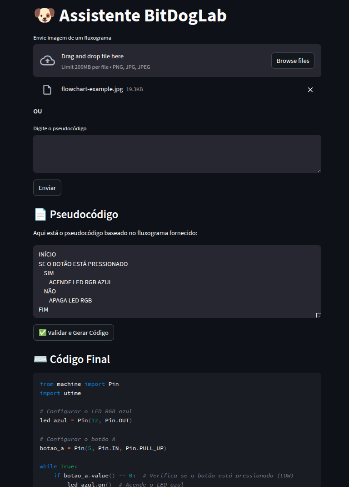
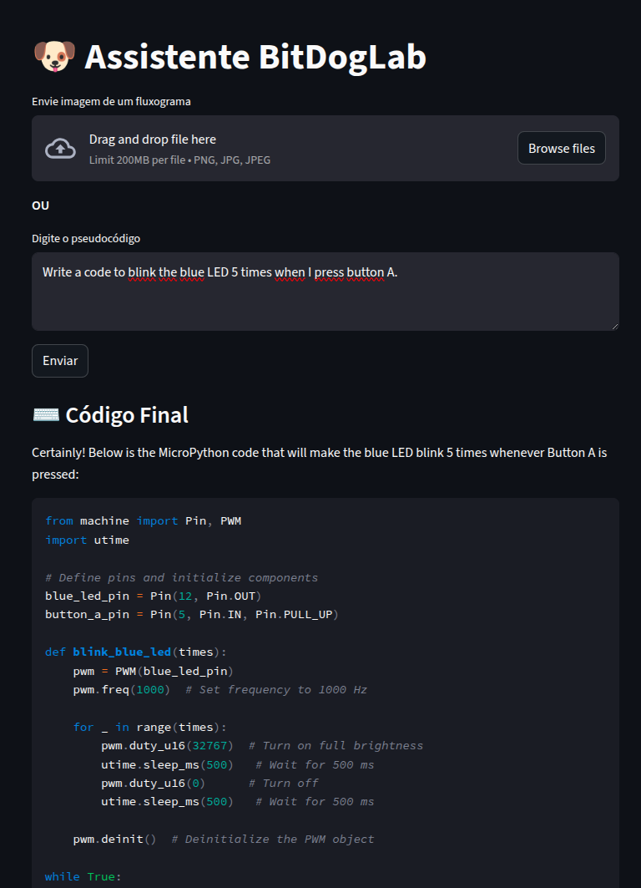

# Project Overview: BitDogLab Chatbot

BitDogLab, an initiative of the School Project 4.0 at Unicamp, is an education tool designed to promoting learning in embedded systems, programming, and electronics. BitDogLab aims to catalyze the incorporation of educational technology, providing a robust and flexible tool uniquely integrated into students' learning journey. More information at: <https://github.com/Fruett/BitDogLab>.

The BitDogLab Chatbot is a virtual assistant designed to help beginner students create code for the BitDogLab. Given a picture of a hand-drawn flowchart, the chatbot first generates pseudocode based on the flowchart, returning the logic it describes, then produces Python code from the pseudocode, making it easier for users to implement their programs.

## Directory Structure

The project is structured as follows:

```plaintext
BitDogLab-Chatbot/
├── src/
│   ├── agents.py                # Core implementation of the agents
│   ├── coordinator.py           # Core implementation of the coordinator
│   ├── app.py                   # Main application file
|   ├── prompt_loader.py         # Utility class for loading prompts
│   ├── utils.py                 # Utility functions for the project
├── prompts/
│   ├── coder/
│   |   ├── v1-pt-bih.txt        # Portuguese prompt for the coder, containing BIH information
│   ├── flowchart_reader/
│       ├── v1-en.txt            # English prompt for the flowchart reader
│       ├── v1-pt.txt            # Portuguese prompt for the flowchart reader
├── .gitignore                   # Git ignore file for excluding unnecessary files
├── flowchart-example.jpg        # Example flowchart image for testing
├── LICENSE                      # License file
├── requirements.txt             # Required Python packages for the project
```

---

## How to run the project?

### 1. Setup the environment

1. Clone the repository: `git clone https://github.com/AI-Unicamp/BitDogLab-Chatbot.git`
2. Create a virtual environment and install the required Python packages:

    ```bash
    python3 -m venv .venv
    source .venv/bin/activate
    pip install -r requirements.txt
    ```

### 2. Running the app

From the root directory of the project, run the app with: `streamlit run src/app.py`

### 3. Using the app

When you open the app, you will see a file uploader where you can upload an image of a flowchart and a text input where you can enter pseudocode or a natural language prompt. Below are instructions on how to use the app, depending on the option selected:

#### 3.1. Upload an image of a flowchart

To generate code from a flowchart, follow these steps:

- Click the "Upload" button to select a flowchart image file.
- Click the "Enviar" button to send the image and generate the pseudocode
- Check the generated pseudocode to ensure it is correct and make any necessary changes.
- When you are done, click the "✅ Validar e Gerar Código" button to generate code.



#### 3.2. Enter pseudocode or natural language prompt

If you instead wish to generate code directly from a pseudocode or natural language prompt, follow these steps: first, enter the pseudocode or prompt in the text input field, then click the "Enviar" button. The code will be generated and displayed on screen, as shown in the image below:



---

## Contact

**Matheus Gasparotto Lozano**\
Dept. of Computer Engineering and Automation (DCA)\
Universidade Estadual de Campinas (UNICAMP)\
<m247275@dac.unicamp.br> | <lozavival@gmail.com>
